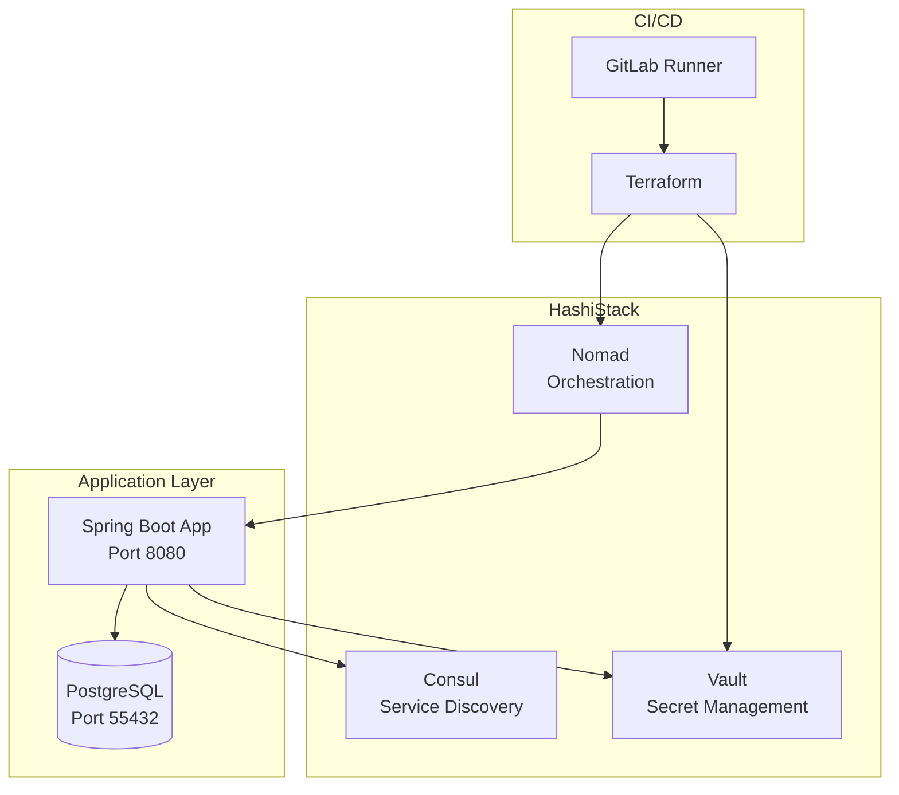

# HashiStack Integration Demo

A comprehensive demonstration of integrating HashiCorp tools (Consul, Vault, Nomad) with a Spring Boot application, featuring automated deployments via Terraform and GitLab CI/CD.

## 🚀 Overview

This project showcases a complete infrastructure-as-code setup using the HashiCorp stack to deploy and manage a Spring Boot application. It demonstrates:

- **Service Discovery** with Consul
- **Secret Management** with Vault (including dynamic database credentials)
- **Workload Orchestration** with Nomad
- **Infrastructure Provisioning** with Terraform
- **Continuous Integration/Deployment** with GitLab CI/CD

## 📋 Prerequisites

- Docker and Docker Compose
- PowerShell (for deployment script)
- Java 21+ (for local development)
- Maven 3.6+ (for local development)

## 🏗️ Architecture



## 🛠️ Technology Stack

### Infrastructure
- **Consul** (v1.15.4) - Service mesh and discovery
- **Vault** (v1.21) - Secrets management with dynamic database credentials
- **Nomad** (latest) - Container orchestration
- **Terraform** (v1.9) - Infrastructure as code
- **PostgreSQL** (v15) - Database

### Application
- **Spring Boot** (v4.0.0) - Java 21
- **Spring Data JPA** - Database access
- **Spring Actuator** - Health checks and metrics
- **SpringDoc OpenAPI** (v2.6.0) - Swagger UI/API documentation
- **Lombok** - Code generation
- **PostgreSQL Driver** - Database connectivity

### DevOps
- **GitLab CI/CD** - Automated pipelines
- **Docker** - Containerization
- **Maven** - Build tool

## 🚦 Quick Start

### Local Deployment

1. **Clone the repository**
   ```powershell
   git clone <repository-url>
   cd hashistack
   ```

2. **Deploy the entire stack**
   ```powershell
   .\deploy.ps1
   ```

   This script will:
   - Build the Spring Boot application Docker image
   - Start Consul, Vault, and Nomad services
   - Initialize and apply Terraform configurations
   - Deploy the application via Nomad

3. **Access the services**
   - **Spring Boot App**: http://localhost:8080/hello
   - **Swagger UI**: http://localhost:8080/swagger-ui.html
   - **Nomad UI**: http://localhost:4646/ui
   - **Consul UI**: http://localhost:8500/ui
   - **Vault UI**: http://localhost:8200/ui (Token: `root`)

### Manual Deployment

If you prefer to run services individually:

```powershell
# Build the Spring Boot app
docker compose build springboot-app

# Start HashiStack services
docker compose up -d consul vault nomad

# Start PostgreSQL database
docker compose up -d postgres

# Start the application
docker compose up -d springboot-app
```

## 🔧 Development

### Running the Spring Boot App Locally

```bash
cd springboot-app
mvn spring-boot:run
```

### Building the Application

```bash
cd springboot-app
mvn clean package
```

The JAR file will be created in `target/springboot-app-0.0.1-SNAPSHOT.jar`

### Running Tests

```bash
cd springboot-app
mvn test
```

## 🔐 Vault Integration

### Dynamic Database Credentials

The application is configured to use Vault's database secrets engine for dynamic PostgreSQL credentials:

1. Vault is configured via Terraform to connect to PostgreSQL
2. AppRole authentication provides the app access to Vault
3. Dynamic credentials are generated on-demand with short TTLs
4. Credentials are automatically rotated

**Manually retrieve dynamic credentials:**

```powershell
curl --header "X-Vault-Token: root" http://localhost:8200/v1/database/creds/app-db-role
```

### AppRole Authentication

The Terraform setup creates:
- Vault policy: `app-policy`
- AppRole: `app-role` with role_id and secret_id

For production, use Nomad's Vault integration instead of embedding credentials.

## 🔗 Consul Service Discovery

The Spring Boot application automatically registers with Consul when deployed via Nomad. The service registration includes:
- Health checks
- Service metadata
- Consul Connect sidecar for mTLS

## 📦 Docker Compose Services

| Service | Port(s) | Description |
|---------|---------|-------------|
| consul | 8500 | Service discovery and configuration |
| vault | 8200 | Secrets management |
| nomad | 4646, 4647, 4648 | Workload orchestration |
| postgres | 55432 (host) → 5432 (container) | PostgreSQL database |
| springboot-app | 8080 | Spring Boot application |
| terraform | - | Infrastructure provisioning |
| gitlab-runner | - | CI/CD runner |

## 🔄 CI/CD Pipeline

The GitLab CI pipeline (`.gitlab-ci.yml`) includes three stages:

1. **Build**: Compiles the Spring Boot app with Maven
2. **Publish**: Builds and pushes Docker image to registry
3. **Deploy**: Runs Terraform to provision infrastructure and deploy via Nomad

### Required CI/CD Variables

Set these in GitLab → Settings → CI/CD → Variables:

- `CI_REGISTRY_USER` / `CI_REGISTRY_PASSWORD` - Container registry credentials
- `NOMAD_ADDR` - Nomad API URL (e.g., http://nomad.example:4646)
- `VAULT_ADDR` - Vault API URL (e.g., http://vault.example:8200)
- `CONSUL_HTTP_ADDR` - Consul URL (e.g., http://consul.example:8500)
- `VAULT_TOKEN` - Vault authentication token

See [CI_README.md](CI_README.md) for detailed CI/CD documentation.

## 📁 Project Structure

```
hashistack/
├── springboot-app/        # Spring Boot application source
│   ├── src/
│   ├── pom.xml
│   └── Dockerfile
├── terraform/             # Terraform configurations
│   ├── main.tf
│   ├── variables.tf
│   └── outputs.tf
├── nomad/                 # Nomad job specifications
│   └── app.nomad.hcl
├── vault/                 # Vault configurations
├── gitlab-runner/         # GitLab Runner configs
├── docker-compose.yml     # Docker Compose orchestration
├── deploy.ps1            # Automated deployment script
├── .gitlab-ci.yml        # CI/CD pipeline definition
├── CI_README.md          # Detailed CI/CD documentation
└── README.md             # This file
```

## 🔒 Security Considerations

> [!CAUTION]
> The following security practices are for **development only**. Do NOT use in production:
> - Vault root token is set to `root`
> - Database credentials are hardcoded
> - Services run in development mode

### Production Recommendations

1. **Vault**
   - Use proper authentication methods (LDAP, OIDC, etc.)
   - Enable audit logging
   - Use namespaces for multi-tenancy
   - Seal/unseal procedures

2. **Consul**
   - Enable ACLs
   - Use TLS for all communications
   - Configure gossip encryption

3. **Nomad**
   - Enable ACLs
   - Configure Vault integration for task authentication
   - Use TLS for API/RPC communications

4. **Database**
   - Use managed database services
   - Rotate root credentials
   - Enable SSL/TLS connections
   - Configure proper backup strategies

## 🧪 Testing Endpoints

Once deployed, test the application:

```bash
# Health check
curl http://localhost:8080/actuator/health

# Hello endpoint
curl http://localhost:8080/hello

# API documentation
open http://localhost:8080/swagger-ui.html
```

## 🐛 Troubleshooting

### Services won't start
```powershell
# Check service logs
docker compose logs consul
docker compose logs vault
docker compose logs nomad
docker compose logs springboot-app
```

### Database connection issues
```powershell
# Verify PostgreSQL is running
docker compose ps postgres

# Check database logs
docker compose logs postgres

# Verify database credentials in environment
docker compose exec springboot-app env | grep DB_
```

### Terraform issues
```powershell
# Re-initialize Terraform
docker compose run --rm terraform init -reconfigure

# Check Terraform state
docker compose run --rm terraform show
```

## 📚 Additional Resources

- [HashiCorp Consul Documentation](https://www.consul.io/docs)
- [HashiCorp Vault Documentation](https://www.vaultproject.io/docs)
- [HashiCorp Nomad Documentation](https://www.nomadproject.io/docs)
- [Spring Boot Documentation](https://spring.io/projects/spring-boot)
- [Terraform Documentation](https://www.terraform.io/docs)

## 📝 License

[Add your license here]

## 👥 Contributing

[Add contribution guidelines here]

---

**Note**: This is a demonstration project for learning and development purposes. For production use, please follow HashiCorp's and Spring's security best practices.
